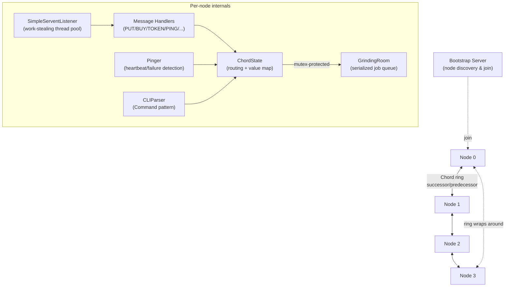

# Peer Market

A **peer-to-peer distributed marketplace** built from scratch on top of a custom **Chord Distributed Hash Table (DHT)** implementation in Java. Nodes ("servents") form a self-organizing overlay ring, list and buy items via **consistent hashing**, coordinate concurrent stock updates with a **custom distributed mutual-exclusion algorithm**, replicate data for fault tolerance, and detect node failures via a **gossip-style heartbeat protocol** — all over raw TCP sockets with a hand-rolled application-layer messaging protocol.

This project demonstrates core **distributed systems** concepts end-to-end: overlay routing, consistent hashing, distributed locking/consensus, replication, failure detection, and pub/sub — implemented without any external frameworks.

---

## Key Features

- **Chord DHT overlay network** — nodes join a logical ring via consistent hashing; each node owns a range of keys and maintains a finger/successor table for **O(log N) routing**.
- **Distributed marketplace operations** — `PUT` (list an item), `GET`/`SEARCH` (look up an item), `BUY` (purchase) are routed hop-by-hop across the ring to the node that owns the corresponding key.
- **Distributed mutual exclusion** — a token-based algorithm (Suzuki–Kasami-style, with per-node request counters and a token-carried request queue) serializes concurrent `PUT`/`BUY` operations on the ring to prevent race conditions such as double-selling the same item.
- **Fault tolerance & replication** — every node backs up its data to its immediate successor (primary-backup replication); on node failure, ownership ranges and data are automatically taken over by neighboring nodes.
- **Failure detection** — a heartbeat/ping mechanism with **weak suspicion** (indirect probing through a random neighbor, SWIM-inspired) and **strong suspicion** (timeout-based removal) thresholds, fully configurable per node.
- **Publish/Subscribe** — nodes can subscribe to another node's ID and receive routed notifications through the DHT.
- **Bootstrap & join protocol** — a dedicated bootstrap server coordinates new node admission and Chord-ID collision detection before a node joins the ring.
- **Interactive CLI** — a REPL-style command-line interface (`buy`, `list`, `subscribe`, `search`, `info`, `give_token`, ...) for driving and inspecting each node live.
- **Multi-node simulation harness** — spins up an arbitrary number of independent node processes (plus a bootstrap server) from a single properties file, with scripted input and captured output/error logs per node, for reproducible distributed-systems testing.

---

## Tech Stack & Techniques

**Language**
- Java (plain SE, no external frameworks/dependencies — networking, concurrency and serialization all built on the standard library)

**Distributed Systems Concepts**
- **Consistent hashing** — custom hash function mapping nodes and item keys onto a Chord ring
- **Chord DHT routing** — successor/finger table with exponentially-increasing offsets for logarithmic-hop lookups
- **Distributed mutual exclusion** — token-passing algorithm with per-node request vectors, closely modeled on **Suzuki–Kasami**
- **Primary-backup replication** — successor-based data backup and automatic range takeover on failure
- **Failure detection** — heartbeat/timeout-based liveness checks with indirect ("gossip") probing, inspired by the **SWIM** protocol
- **Publish/Subscribe messaging** pattern routed over the DHT

**Networking**
- Raw **TCP sockets** (`ServerSocket`/`Socket`)
- Custom application-layer wire protocol — **Java Object Serialization** for message transport
- 20+ distinct message types (`PUT`, `BUY`, `TOKEN`, `TOKENREQUEST`, `PING`/`PONG`, `DEADNODE`, `SUBSCRIBE`, ...) dispatched to dedicated handler classes

**Concurrency & Multithreading**
- `ExecutorService` with a **work-stealing thread pool** for concurrent, per-connection message handling
- Dedicated single-thread executor acting as a **serialized job queue** ("critical section" worker) for mutually-exclusive marketplace operations
- `ConcurrentHashMap`, `ConcurrentLinkedQueue`, `AtomicInteger`, `volatile` state, and `synchronized` blocks for thread-safe shared state across networking and business-logic threads
- Independent background threads per node: listener, heartbeat/pinger, CLI reader, ring initializer

**Process Orchestration**
- Java `Process`/`ProcessBuilder` API to launch and manage multiple independent JVM instances (simulated network nodes) from a single test harness, with per-node stdin/stdout/stderr redirection to files for reproducible test runs

**Design Patterns**
- **Command pattern** for the CLI (`CLICommand` interface, dynamically dispatched by name)
- **Strategy/Handler pattern** for network message processing (`MessageHandler` implementations per `MessageType`)
- Layered architecture: `app` (node/ring state & config), `servent` (networking, messages, handlers), `mutex` (distributed locking & job execution), `cli` (user interaction)

---

## Architecture



## Project Structure

```
src/
├── app/        # Node bootstrap, Chord ring state & routing, failure detection (Pinger), config
├── servent/    # Networking layer: message types, socket listener, per-message handlers
├── mutex/      # Token-based distributed mutual exclusion + serialized job execution
└── cli/        # Interactive command-line interface (Command pattern)
chord/          # Multi-node simulation config + scripted input/output/error logs per node
```

## Getting Started

```bash
# Compile
javac -d out $(find src -name "*.java")

# Run the bootstrap server
java -cp out app.BootstrapServer 2000

# Run a single node (id must match an entry in servent_list.properties)
java -cp out app.ServentMain chord/servent_list.properties 0

# ...or launch a full simulated network (bootstrap + all nodes) in one go
java -cp out app.MultipleServentStarter chord
```

Ring size, node ports, and failure-detection thresholds are all configured in `servent_list.properties`.

---